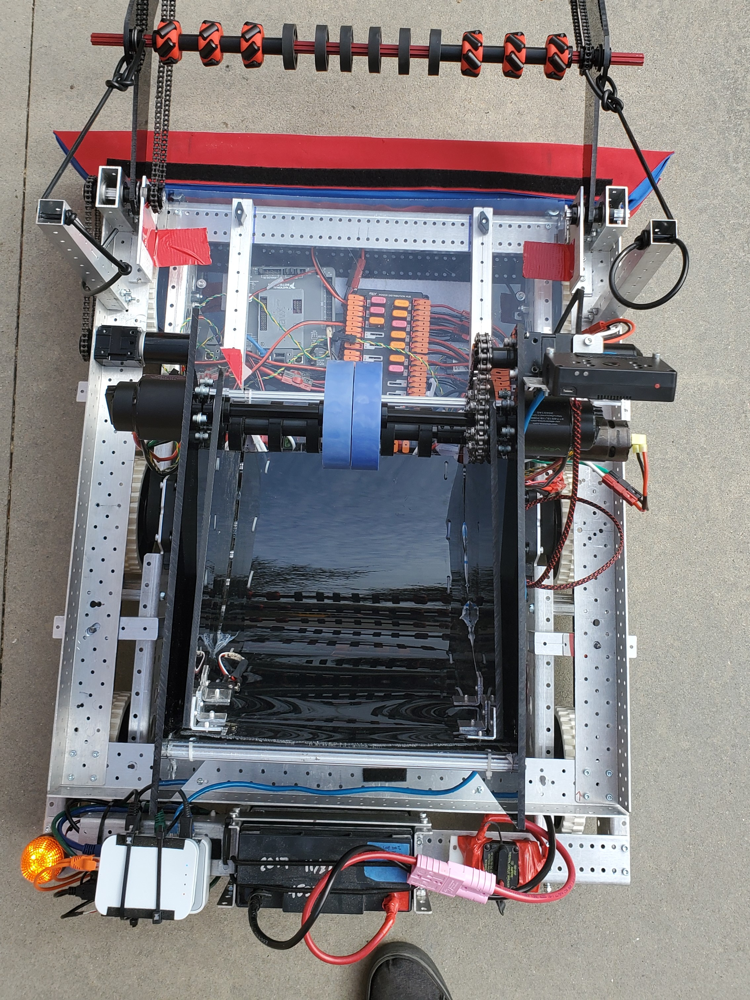
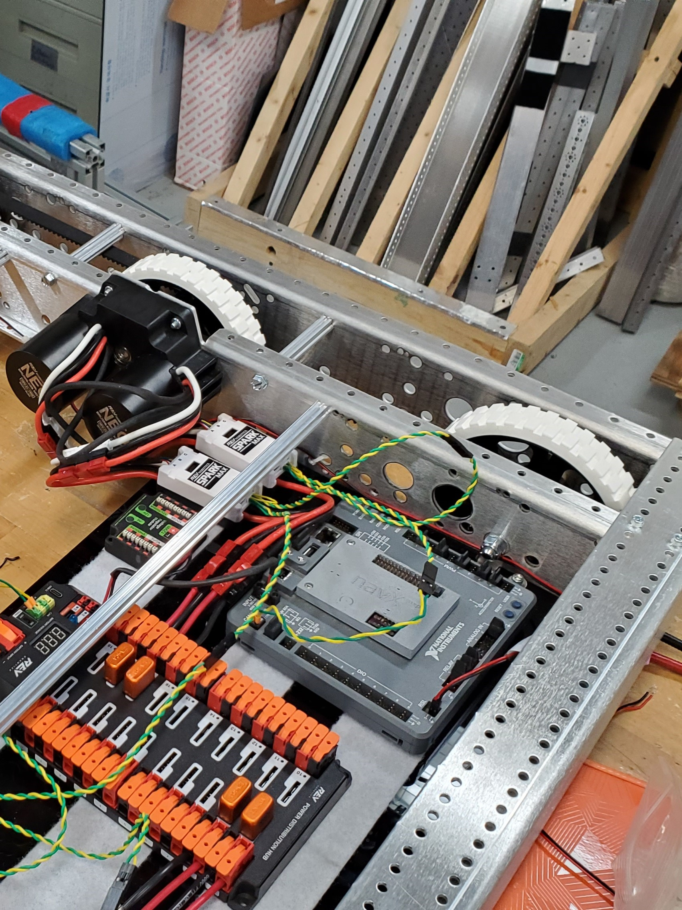

+++
description = "4533 Phoenix's GlaDOS"
title = "(2022) Rapid React"
+++

## Overview

We were required to pick up very large tennis balls called cargo, and launch
them into a hub where they were counted for points. We also had to climb a
series of increasingly higher rungs. We went to Electric City and Smoky Mountain
Regionals in season, and SCRIW off-season. We were finalists at Electric City
and SCRIW.

## Links

- [Robot Code](//github.com/4533-phoenix/rapid-react-robot)

## Media


  
  
  
  
  
