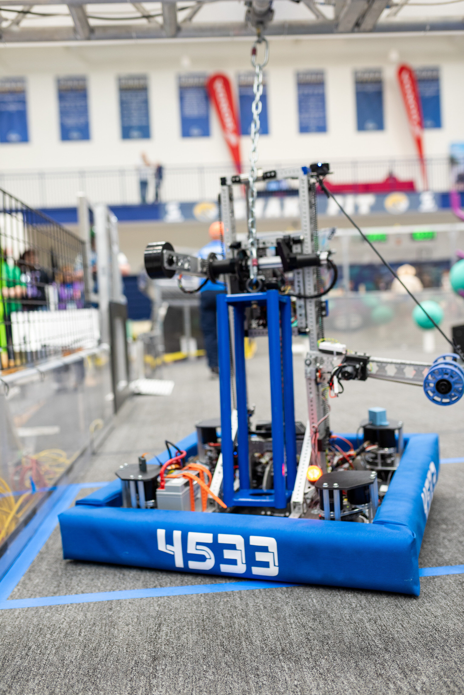
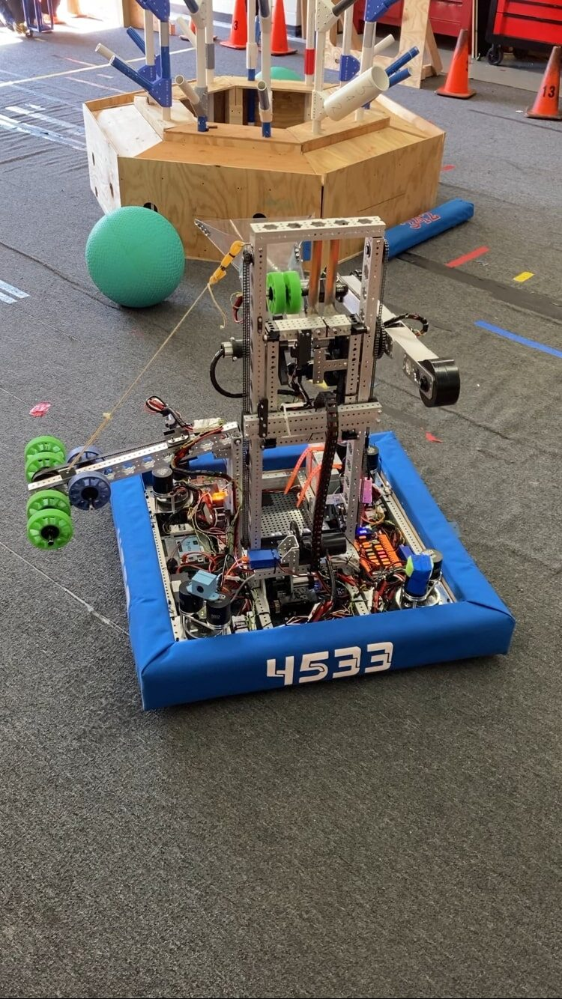
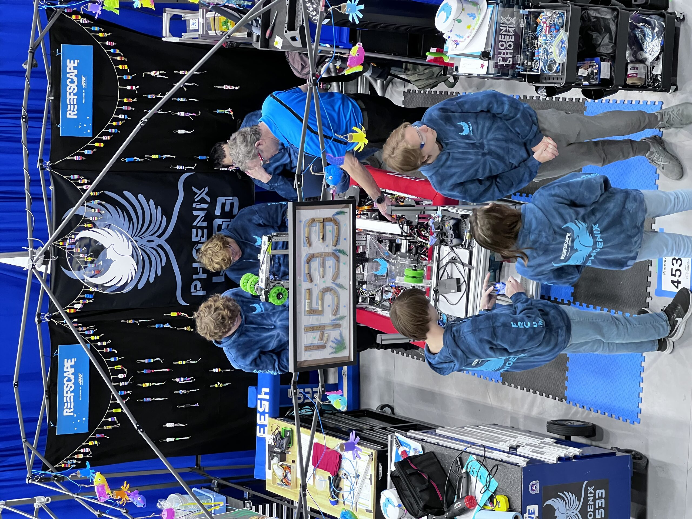
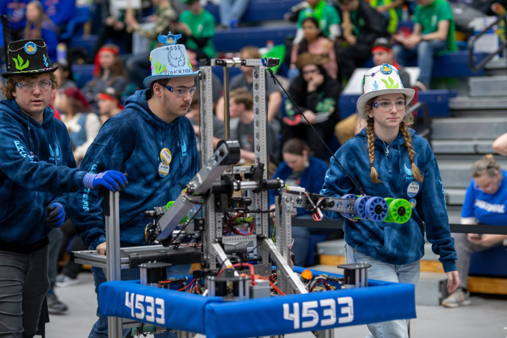
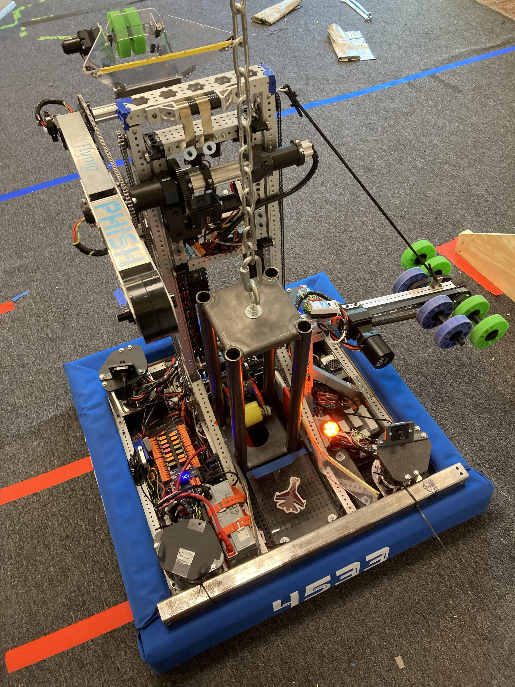
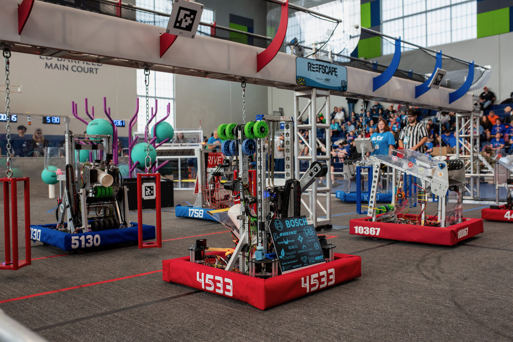
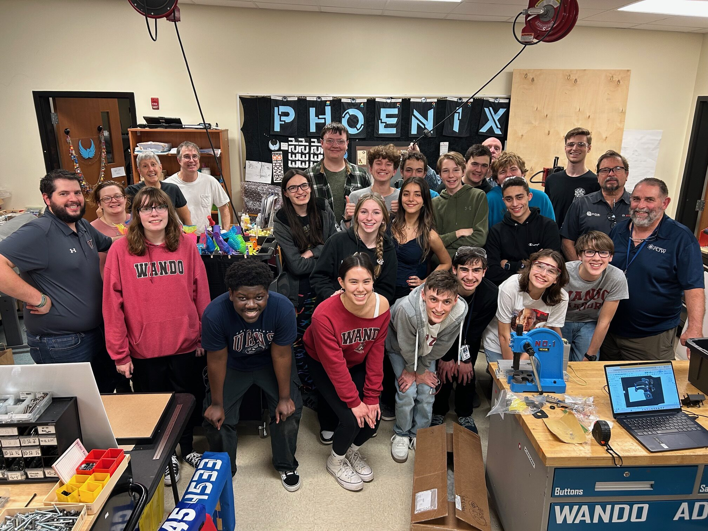
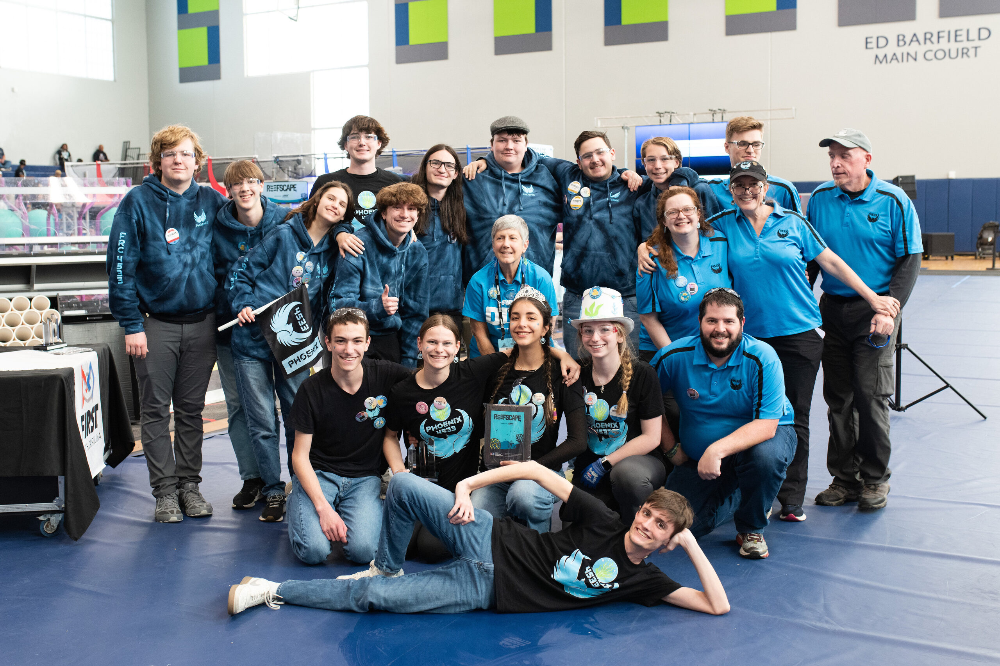

+++
description = "4533 Phoenix's Flying Phish"
title = "(2025) Reefscape"
+++

## Overview

This season required us to pick up large PVC pipes (called coral) and large green
playground balls (called algea). We had to place the coral onto the reef in the middle
of the field on one of the 4 levels. The higher the level the more points it was worth.
To score, we also had to remove algea from the reef to put coral onto it. We could
optionally score algea in the processor for a co-op point and 6 regular points. We went
to Hartsville and North Charleston, getting 2nd place by 4 point. We are going to Disctrict
in Anderson.

## Links

- [CAD](//cad.onshape.com/documents/621e766fc52120430eedd5dc/w/b52719b653a7a6f5a92e8f72/e/5ca0763b4ce8342a30b19f15)
- [Robot Code](//github.com/4533-phoenix/frc-2025-robot)
- [Vision](//github.com/chalkydri/chalkydri)
- [Interface](//github.com/4533-phoenix/FRC-2025-Interface)
- [Engineering Notebook](//docs.google.com/presentation/d/1S9-BkZvV-qE0_MtkB9sYIFMKiQb-eqAMHzrOuboZwo8/view)

## Media


  
  
  
  
  
  
  
  
  
  
