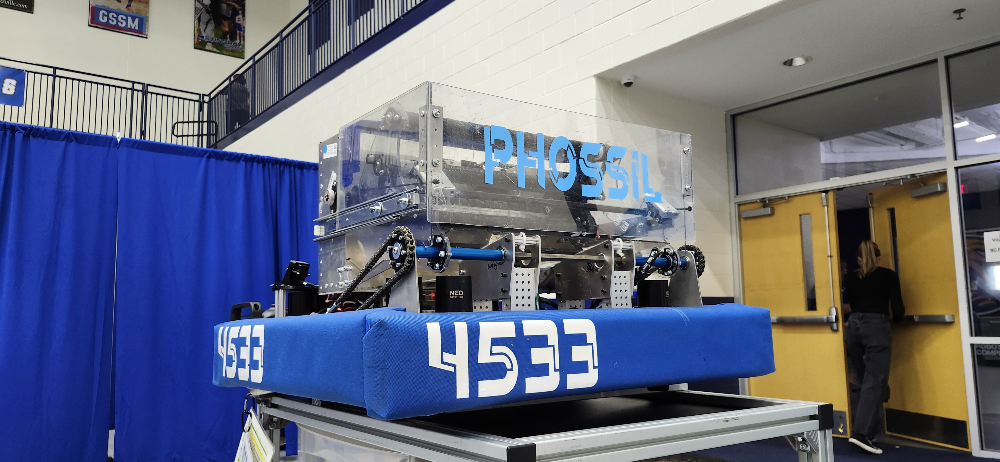
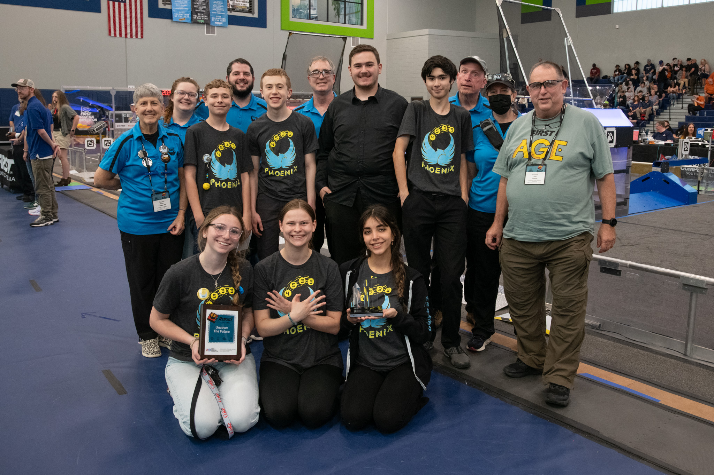
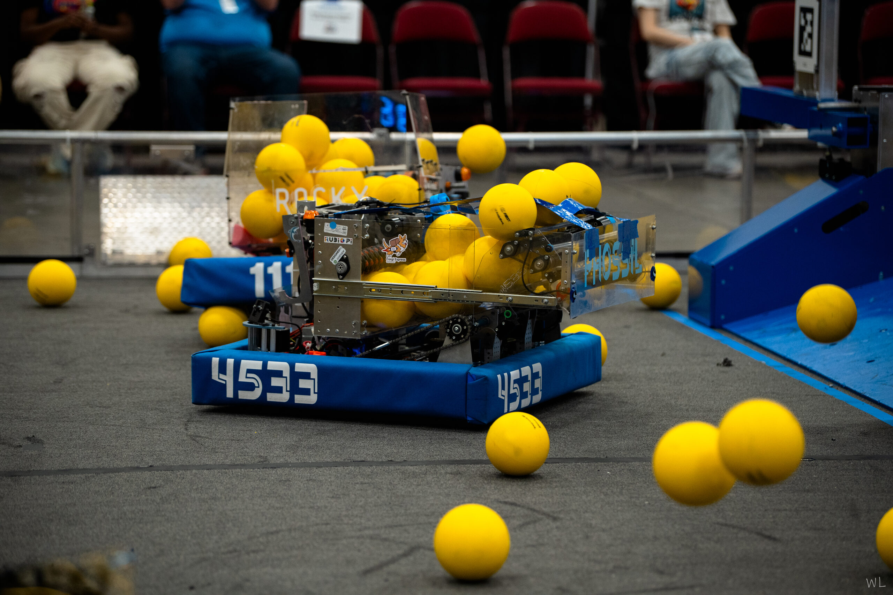
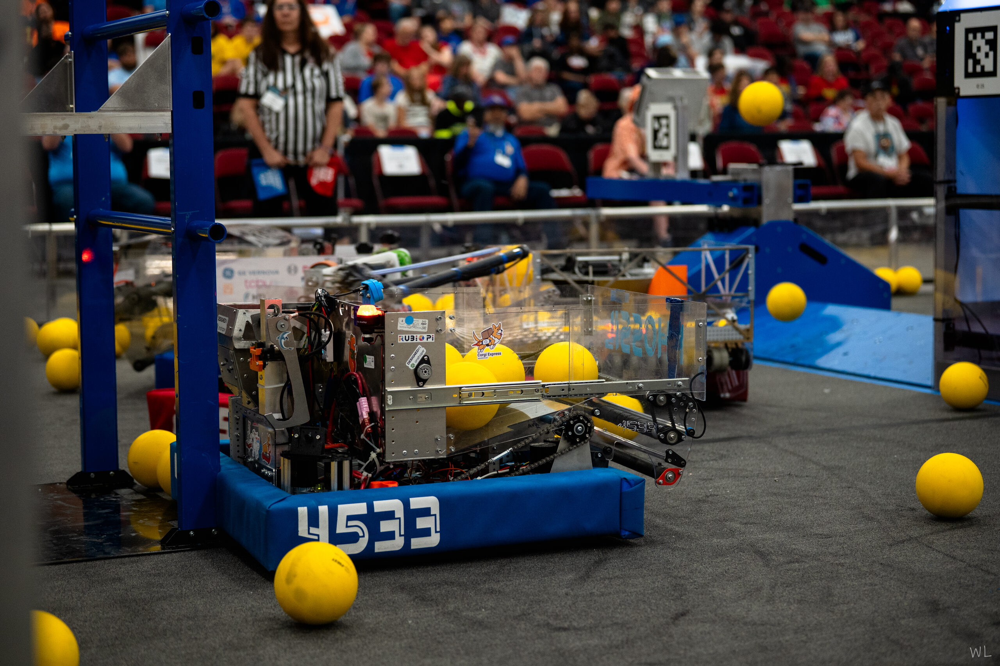
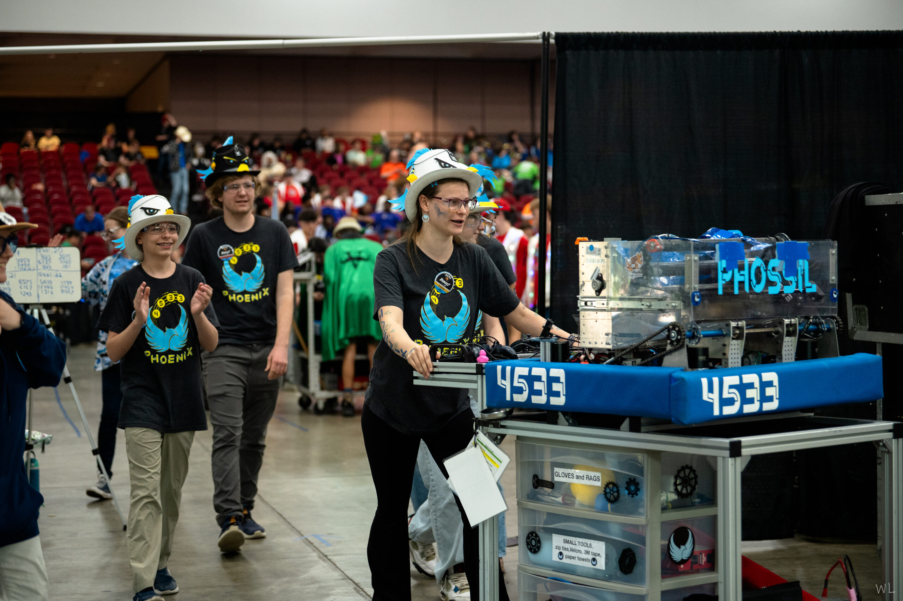

+++
description = "4533 Phoenix's Fossil"
title = "(2026) Rebuilt"
+++

## Overview

This season required us to pick up yellow foam balls (called fuel).
We had to shoot the fuel into the hub on our alliance.
To score, we also could climb the tower for 10, 20, or 30 points. We went
to North Charleston, Hartsville and advanced to the South Carolina State Chamionship after ranking 30th place at Hartsvile. At the state Championship we managed to
rank [5th out of the 31 teams.](https://www.statbotics.io/event/2026sccmp#:~:text=Phoenix-,5,-1576)
This success was thanks to minor mechanical adjustments from the build team and the implementation of two custom, student-developed software programs enableing our robot to perform better in both the automous and human contolled parts of the game.
* **Whacknet:** A highly efficient UDP vision protocol system that helped the robot "see" almost instantly. 
* **SparkTap:** A reverse engineered solution that allowed the robot to read motor telemetry in the sub-millisecond range.
## Links

- [Robot Code](//github.com/4533-phoenix/frc-2026-robot)
- [Vision 1](//github.com/4533-phoenix/photonvision)
- [SparkTap](https://github.com/4533-phoenix/frc-2026-robot/wiki/SparkTap-%E2%80%90-CAN-Interception)
- [Whacknet](https://github.com/4533-phoenix/frc-2026-robot/wiki/Whacknet-%E2%80%90-UDP-Vision-Protocol)
- [Vision 2](//github.com/chalkydri/chalkydri)

## Media


  
  
  
  
  

