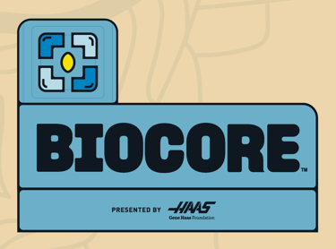

+++
description = "4533 Phoenix's YetToBeBuiltRobot"
title = "(2027) BIOCORE"
+++

## Overview

In BIOCORE™ presented by Haas, a new challenge releasing January 9, 2027, FIRST Robotics Competition teams will use engineering skills and delve into the heart of what sustains life on Earth.

[BIOCORE info](https://www.firstinspires.org/programs/frc/game-and-season)

## Links

- add game animation when it becomes available after JAN 9, 2027
- add media link and more
- logo files for CANOPY which BIOCORE falls under https://www.firstinspires.org/resources/library/season-brand-downloads 

## Media


  

